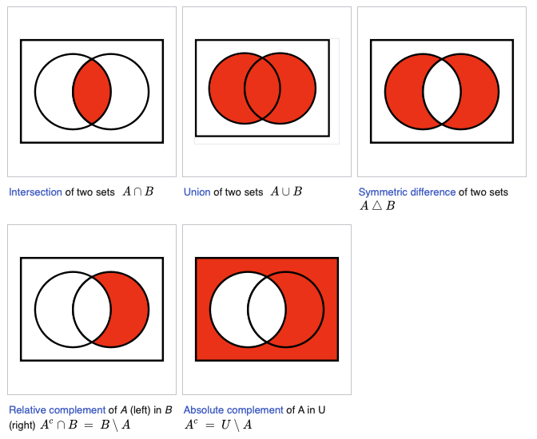

# Set Theory

## Introduction

Knowledge of elementary set theory is essential for understanding probability theory.
This chapter is introduces the concepts in set theory required for understanding
probability theory.

## Sets, elements, and subsets

A set is a well-defined collection of objects. The objects in a set are called elements.
The sets are usually denoted by capital letters like $A$, $X$ etc., and the elements are
usually denoted by lower case letters like $a$, $x$ etc. Note that ordering of elements
in a set is not important. For example, the set $A = \{1, 2, 3\}$ is the same as the set
$A = \{3, 2, 1\}$. Also note that the elements of a set are unique. For example, the set
$A = \{1, 2, 3, 3\}$ is the same as the set $A = \{1, 2, 3\}$.

In python, a set is created using the `set` function:

=== "Python"

    ```python
    A = set([1, 2, 3])

    # The following is equivalent to the above
    A = {1, 2, 3}

    assert {1, 2, 3} == {1, 1, 2, 2, 3, 3}
    assert {1, 2, 3} == {3, 2, 1}
    ```

    If we define a custom class to represent a set, we would define it as follows:

    ```python
    import typing as t

    T = t.TypeVar("T")

    class Set(t.Generic[T]):
        def __init__(self, elements: t.List[T]) -> None:
            self.elements = []
            for element in elements:
                if element not in self.elements:
                    self.elements.append(element)
    ```

    To check if two sets are equal using the `==` operator, we would define the `__eq__`
    method on the above class as follows:

    ```python
    class Set(t.Generic[T]):
        ...
        def __eq__(self, other: t.Any) -> bool:
            """Check if two sets are equal."""
            if not isinstance(other, Set):
                return False
            if len(self.elements) != len(other.elements):
                return False
            for element in self.elements:
                if element not in other.elements:
                    return False
            return True
    ```

    We can create a set of integers as follows:

    ```python
    A = Set([1, 2, 3])

    assert Set([1, 2, 3]) == Set([1, 1, 2, 2, 3, 3])
    assert Set([1, 2, 3]) == Set([3, 2, 1])
    ```

The following expression implies that $a$ is an element of $A$:

$$a \in A$$

The following expression implies that $a$ is not an element of $A$:

$$a \notin A$$

We can use the above notation for multiple elements as follows:

$$a, b, c \in A$$

$$a, b, c \notin A$$

=== "Python"

    In python, we can check if an element is in a set (or any other collection) using
    the `in` operator:

    ```python
    A = {1, 2, 3}
    assert 1 in A
    assert 4 not in A
    ```

    We can implement the `__contains__` method on the `Set` class to check if an element
    is in a set:

    ```python
    class Set(t.Generic[T]):
        ...
        def __contains__(self, element: T) -> bool:
            """Check if an element is in a set."""
            return element in self.elements  # (1)!
    ```

    1. Since the python `list` is also a collection, it implements the `__contains__`
       method. So we can use the `in` operator on a list to check if an element is in
       the list.

### Subsets

A set $B$ is a subset of a set $A$ if every element of $B$ is also an element of $A$. We
denote this as $B \subseteq A$. For example, the set $B = \{1, 2\}$ is a subset of the
set $A = \{1, 2, 3\}$.

In python, we can check if a set is a subset of another set using the `issubset` method
on the `set` class:

=== "Python"

    ```python
    A = {1, 2, 3}
    B = {1, 2}
    assert B.issubset(A)
    ```

    We can implement the `issubset` method on the `Set` class as follows:

    ```python
    class Set(t.Generic[T]):
        ...
        def issubset(self, other: "Set[T]") -> bool:
            """Check if a set is a subset of another set."""
            for element in self.elements:
                if element not in other.elements:
                    return False
            return True
    ```

The above definition implies that any set $A$ is always a subset of itself.

### Equality

Two sets are equal if they have the same elements. We denote this as $A = B$. Two sets
are equal if and only if they are subsets of each other.

$$A = B \iff A \subseteq B \land B \subseteq A$$

In python, we can check if two sets are equal using the `==` operator:

=== "Python"

    ```python
    A = {1, 2, 3}
    B = {1, 2}
    assert A == B
    assert A.issubset(B) and B.issubset(A)
    ```

    To make our `Set` class support equality checks using the `==` operator, we can
    implement the `__eq__` method on the `Set` class as follows:

    ```python
    class Set(t.Generic[T]):
        ...
        def __eq__(self, other: t.Any) -> bool:
            """Check if two sets are equal."""
            if not isinstance(other, Set):
                return False
            if len(self.elements) != len(other.elements):
                return False
            for element in self.elements:
                if element not in other.elements:
                    return False
            return True
    ```

We denote that a set $A$ is not equal to a set $B$ as $A \neq B$.

### Proper subsets

A set $B$ is a proper subset of a set $A$ if every element of $B$ is also an element of
$A$ and $B$ is not equal to $A$. We denote this as $B \subset A$. For example, the set
$B = \{1, 2\}$ is a proper subset of the set $A = \{1, 2, 3\}$.

In python, we can check if a set is a proper subset of another set by combining the
`issubset` and `__eq__` methods:

=== "Python"

    ```python
    def is_proper_subset(A: set, B: set) -> bool:
        """Check if a set is a proper subset of another set."""
        return A.issubset(B) and not A == B

    A = {1, 2}
    B = {1, 2, 3}
    assert is_proper_subset(A, B)
    ```

    We can implement the `is_proper_subset` method on the `Set` class as follows:

    ```python
    class Set(t.Generic[T]):
        ...
        def is_proper_subset(self, other: "Set[T]") -> bool:
            """Check if a set is a subset of another set."""
            for element in self.elements:
                if element not in other.elements:
                    return False
            # self is a subset of other
            # check if self is equal to other
            if len(self.elements) == len(other.elements):
                # self is equal to other
                return False
            return True
    ```

We denote that a set $A$ is not a subset of another set $B$ as $A \not\subseteq B$.


### Properties

Given any sets $A$, $B$, and $C$, the following properties hold:

1. $A \subseteq A$
2. $A \subseteq B$  $B \subseteq A \implies A = B$
3. $A \subseteq B$ and $B \subseteq C \implies A \subseteq C$

### Specifying sets

There are two ways of specifying a set:

1. Tabular form or roster method: By listing all the elements of the set.
2. Set-builder form or property method: By specifying a rule for generating the elements of the set.

For example, the set $A = \{1, 2, 3\}$ is specified in the tabular form. The same set
can be specified in the set-builder form as follows:

$$A = \{x: x \in \mathbb{N}, x \leq 3\}$$

The set $\mathbb{N}$ is the set of all natural numbers or positive integeres.

The condition can be rewritten in python as follows:

```python
def condition(x) -> bool:
    return isinstance(x, int) and 0 < x <= 3
```

If you know `Sympy`, you can represent the above set as follows:

```python
import sympy as sp

A = sp.FiniteSet(1, 2, 3)
```

#### Special sets

The following are some special sets:

1. The empty set: $\emptyset$ - This set contains no elements

    ```python
    empty_set = set()

    # or
    empty_set = Set([])
    ```

2. The universal set: $\Omega$ - The set of all elements. We will provide a definition
   for this in python once we define infinite sets.

3. The set of all integers: $\mathbb{Z}$ - The set of all integers, both positive and
   negative.

4. The set of all natural numbers: $\mathbb{N}$ - The set of all positive integers.

5. The set of all rational numbers: $\mathbb{Q}$ - The set of all numbers that can be
   expressed as a ratio of two integers.

6. The set of all real numbers: $\mathbb{R}$ - This includes all rational numbers and
   all irrational numbers.

7. The set of all complex numbers: $\mathbb{C}$ - This includes all real numbers and
   all imaginary numbers.

### Properties

1. If two sets, $A$ and $B$, are both empty, then $A = B$. That is, there is only one
   empty set.

2. For any set $A$, we have $\emptyset \subseteq A \subseteq \Omega$.

### Intervals

We can define subsets of $\mathbb{R}$ using intervals. An interval is a set of numbers
that lie between two numbers. For example, the set of all numbers between 1 and 3 is
denoted as $[1, 3]$. The square brackets denote that $1$ and $3$ are included in the set.
Such a interval is calld a closed interval. In general, there are four types of intervals:

1. Closed interval: $[a, b]$
2. Open interval: $(a, b)$
3. Open-closed interval: $(a, b]$
4. Closed-open interval: $[a, b)$

The numbers $a$ and $b$ are called the endpoints of the interval. We use the "$($" and
"$)$" to denote an open interval and the "$[$" and "$]$" to denote a closed interval.

### Disjoint sets

Two sets $A$ and $B$ are disjoint if they have no elements in common. For example, the
sets $A = \{1, 2\}$ and $B = \{3, 4\}$ are disjoint.

In python, we can check if two sets are disjoint as follows:

```python
A = {1, 2}
B = {3, 4}
assert A.isdisjoint(B)
```

We can implement the `is_disjoint` method on the `Set` class as follows:

```python
class Set(t.Generic[T]):
    ...
    def is_disjoint(self, other: "Set[T]") -> bool:
        """Check if two sets are disjoint."""
        for element in self.elements:
            if element in other.elements:
                return False
        return True
```

### Set operations

#### Union

The union of two sets $A$ and $B$ is the set of all elements that are in $A$ or $B$ or
both. The union of two sets $A$ and $B$ is denoted as $A \cup B$.

For example, the union of the sets $A = \{1, 2\}$ and $B = \{2, 3\}$ is the set
$A \cup B = \{1, 2, 3\}$.

In python, we can compute the union of two sets as follows:

```python
A = {1, 2}
B = {2, 3}
assert A.union(B) == {1, 2, 3}
```

We can implement the `union` method on the `Set` class as follows:

```python
class Set(t.Generic[T]):
    ...
    def union(self, other: "Set[T]") -> "Set[T]":
        """Compute the union of two sets."""
        result: list[T] = []
        for element in self.elements:
            result.append(element)
        for element in other.elements:
            if element not in self.elements:
                result.append(element)
        return Set(result)
```

#### Intersection

The intersection of two sets $A$ and $B$ is the set of all elements that are in $A$ and
$B$. The intersection of two sets $A$ and $B$ is denoted as $A \cap B$.

For example, the intersection of the sets $A = \{1, 2\}$ and $B = \{2, 3\}$ is the set
$A \cap B = \{2\}$.

In python, we can compute the intersection of two sets as follows:

```python
A = {1, 2}
B = {2, 3}
assert A.intersection(B) == {2}
```

We can implement the `intersection` method on the `Set` class as follows:

```python
class Set(t.Generic[T]):
    ...
    def intersection(self, other: "Set[T]") -> "Set[T]":
        """Compute the intersection of two sets."""
        result: list[T] = []
        for element in self.elements:
            if element in other.elements:
                result.append(element)
        return Set(result)
```

#### Difference

The difference of two sets $A$ and $B$ is the set of all elements that are in $A$ but
not in $B$. The difference of two sets $A$ and $B$ is denoted as $A \setminus B$.

For example, the difference of the sets $A = \{1, 2\}$ and $B = \{2, 3\}$ is the set
$A \setminus B = \{1\}$.

In python, we can compute the difference of two sets as follows:

```python
A = {1, 2}
B = {2, 3}
assert A.difference(B) == {1}
```

We can implement the `difference` method on the `Set` class as follows:

```python
class Set(t.Generic[T]):
    ...
    def difference(self, other: "Set[T]") -> "Set[T]":
        """Compute the difference of two sets."""
        result: list[T] = []
        for element in self.elements:
            if element not in other.elements:
                result.append(element)
        return Set(result)
```

#### Symmetric difference

The symmetric difference of two sets $A$ and $B$ is the set of all elements that are in
$A$ or $B$ but not in both. The symmetric difference of two sets $A$ and $B$ is denoted
as $A \triangle B$ or $A \oplus B$.

$$A \triangle B = (A \setminus B) \cup (B \setminus A)$$

$$A \triangle B = (A \cup B) \setminus (A \cap B)$$

For example, the symmetric difference of the sets $A = \{1, 2\}$ and $B = \{2, 3\}$ is
the set $A \triangle B = \{1, 3\}$.

In python, we can compute the symmetric difference of two sets as follows:

```python
A = {1, 2}
B = {2, 3}
assert A.symmetric_difference(B) == {1, 3}
```

We can implement the `symmetric_difference` method on the `Set` class as follows:

```python
class Set(t.Generic[T]):
    ...
    def symmetric_difference(self, other: "Set[T]") -> "Set[T]":
        """Compute the symmetric difference of two sets."""
        return self.union(other).difference(self.intersection(other))
```

#### Complement

The complement of a set $A$ is the set of all elements that are not in $A$. The
complement of a set $A$ is denoted as $A^c$ or $\overline{A}$.

#### Relative complement

The relative complement of a set $A$ with respect to a set $B$ is the set of all
elements that are in $A$ but not in $B$. The relative complement of a set $A$ with
respect to a set $B$ is denoted as $A \setminus B$.

#### Properties

1. For any sets $A$ and $B$, we have:

    $$A \cap B \subseteq A \subseteq A \cup B$$

    $$A \cup B \subseteq B \subseteq A \cap B$$

2. The following are equivalent: $A \subseteq B$, $A \cap B = A$, and $A \cup B = B$.


### Venn Diagrams

Venn diagrams are a useful tool for visualizing sets. The following is a Venn diagram
for the sets $A = \{1, 2, 3\}$ and $B = \{2, 3, 4\}$:


